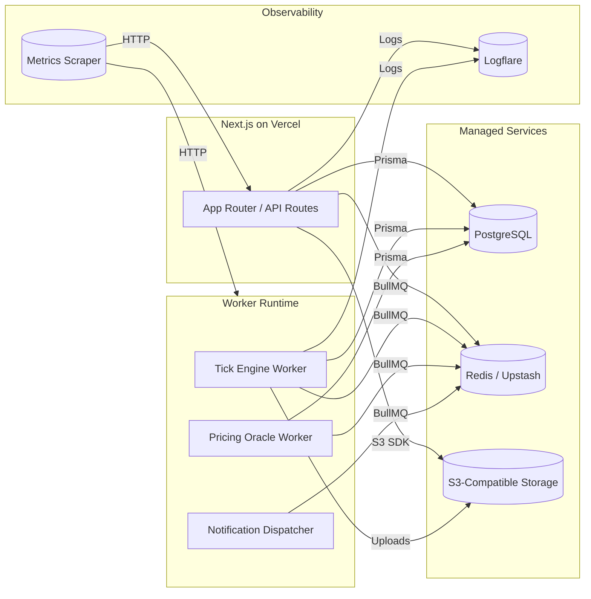

# Infrastructure Diagrams

## Application Topology



## Deployment Pipeline

```mermaid
graph TD
  Dev[Developer]
  GitHub[GitHub]
  CI[GitHub Actions CI]
  Vercel[Vercel Deploy]
  WorkerDeploy[Worker Deploy (Fly/Render/Railway)]

  Dev -->|git push| GitHub
  GitHub --> CI
  CI -->|build & test| CI
  CI -->|vercel --prod| Vercel
  CI -->|docker build/push| WorkerDeploy
```

